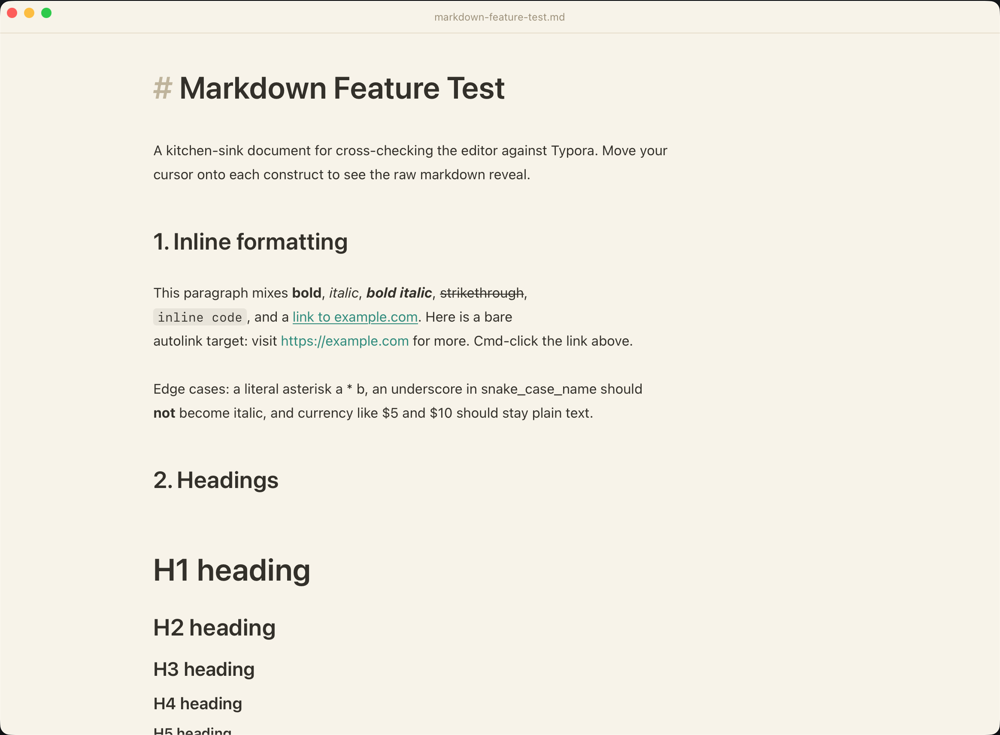
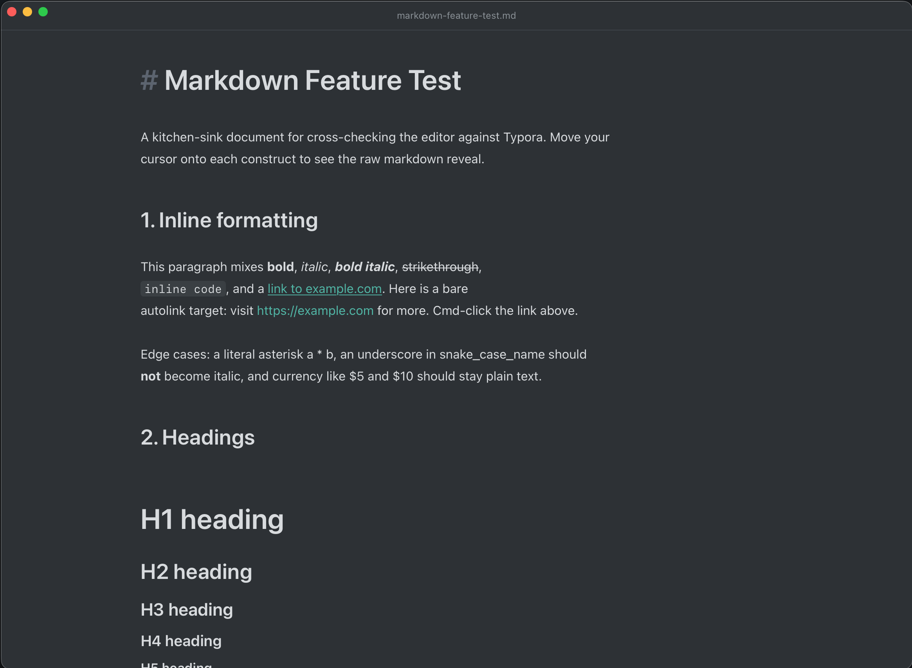

# Vellum

A lightweight, fast, Mac-only Markdown editor. Single-window, document-centric,
with a Typora/Obsidian-style live preview layered directly over the source.

| Light | Dark |
| --- | --- |
|  |  |

- **Shell:** [Tauri 2](https://tauri.app) (Rust + WKWebView)
- **Editor:** [CodeMirror 6](https://codemirror.net) — syntax-highlighted Markdown source
- **Frontend:** vanilla TypeScript + [Vite](https://vitejs.dev)

## Features

- **Live preview** — Typora-style WYSIWYG: headings, bold, and other styling are
  always rendered; only the Markdown markers hide, revealing raw source on the
  line your cursor touches.
- **Math** — `$…$` and `$$…$$` rendered with [KaTeX](https://katex.org) (lazy-loaded).
- **Byte-faithful round-trips** — the editor edits source text directly, so
  saving writes back exactly what's in the buffer (no normalization).
- **Native macOS integration** — native menus and accelerators, "Open With"
  from Finder, Open Recent list, and a custom unsaved-changes guard.
- **Find & Replace** — full-width Typora-style find bar.
- **Themes** — Light (warm paper), Dark (charcoal slate), or follow System.

## Development

Requires Node.js and the [Rust toolchain](https://www.rust-lang.org/tools/install).

```bash
npm install
npm run tauri dev      # run the app (Vite + Rust, hot reload)
npm run build          # tsc + vite build (frontend only)
npm test               # vitest unit tests
cargo check --manifest-path src-tauri/Cargo.toml
npm run tauri build    # release .app + .dmg (see RELEASE.md)
```

## Architecture

See [CLAUDE.md](CLAUDE.md) for a detailed overview of the frontend (`src/`) and
backend (`src-tauri/src/`) modules and conventions.

## Platform

macOS only (minimum 10.15).

## License

[MIT](LICENSE) © boolafish
